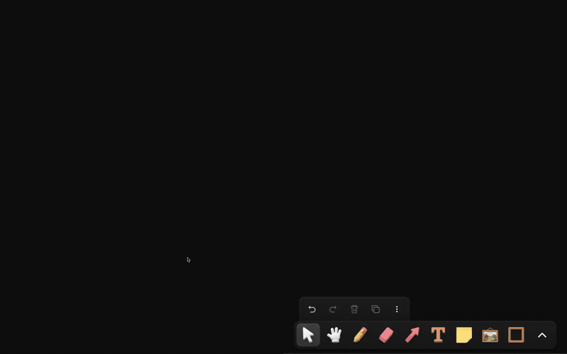

# tldraw-mods

Add-ons for the [tldraw offline](https://offline.tldraw.com) desktop app: new shapes and tools you install into a drawing with one command. Browse them at [tldrawmods.dev](https://tldrawmods.dev).

[](https://tldrawmods.dev)

## How to use

You need the tldraw offline app and Node.js 20 or newer.

Mods are added to one drawing at a time. Each `.tldraw` file can carry its own code, and the app runs it whenever the file is opened. The folder you set up below is where that code is built before it goes into the file.

**1. Make a folder and save your drawing in it.**

```sh
mkdir my-canvas && cd my-canvas
```

In the app: File → New, then File → Save into that folder.

**2. Set up the folder.** Once per folder. This downloads the build files and installs what they need.

```sh
npx tldraw-mods init
```

**3. Add mods.** Keep the drawing open in the app. Each mod is downloaded, built, put into the open drawing, and saved. The new tool shows up in the toolbar after the rectangle tool.

```sh
npx tldraw-mods add landmark
npx tldraw-mods add browser
```

**4. Later.**

- `npx tldraw-mods list` shows every mod you can add.
- `npx tldraw-mods remove browser` takes one out.
- `npx tldraw-mods apply` rebuilds and reloads after you change anything under `src/` yourself.

The mods are saved inside the `.tldraw` file. The drawing keeps them when you move it, share it, or open it on another machine; the folder is only needed to add or remove mods.

If the drawing is saved somewhere else, say where: `npx tldraw-mods add landmark --doc=/path/to/file.tldraw`.

You can also install from any GitHub repo that publishes mods, not just this one: `npx tldraw-mods add owner/repo/name`.

Only install mods from people you trust. A mod is code that runs with the app's permissions every time the drawing is opened.

## What is in this repo

- **`registry.json`** — the list of mods. Each entry names the files to install and what they need. Some entries are our own; others point at mods kept in other people's repos. A check runs on every change and every night to make sure each entry still installs.
- **`cli/`** — the `tldraw-mods` command. It wraps the [shadcn CLI](https://ui.shadcn.com/docs/cli), which does the downloading, and adds the parts specific to tldraw offline: setting up a folder, and putting the built code into the open drawing.
- **`workspace/`** — the files `init` downloads, and where our own mods are written. `build.mjs` looks in `src/mods/`, lists whatever is there, and bundles it all into one file. Adding a mod is adding a file to that folder; there is nothing to register by hand.

## Making your own mod

A mod is one file, `src/mods/<name>.tsx`. Its default export is a function that receives the app's setup object and adds to it, for example pushing a shape class and a tool class. This is the same function signature the app already uses for its own `config.js`. Two optional exports, `tool` and `commands`, put a button in the toolbar and entries in the right-click menu. The types are in `workspace/src/mod.ts`.

To let other people install it, add a `registry.json` to the root of your repo that lists the file and says it installs to `~/src/mods/<name>.tsx`. Do not list `tldraw`, `react`, or `react-dom` as dependencies; the app provides them. Check it with `npx shadcn@latest registry validate`. From then on, `npx tldraw-mods add you/repo/name` works for anyone.

To have it listed on the site, open a pull request here adding an entry to `registry.json` that points at yours. The step-by-step version is at [tldrawmods.dev/protocol](https://tldrawmods.dev/protocol/).

## Working on this repo

```sh
cd workspace && npm install
npm run typecheck        # uses the type definitions shipped inside the installed app
npm run apply            # puts the build into any open drawing saved in this folder
cd ../site && node build.mjs && wrangler pages deploy dist --project-name tldraw-mods
```

Not affiliated with tldraw.
